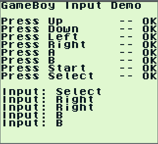
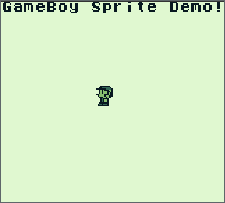
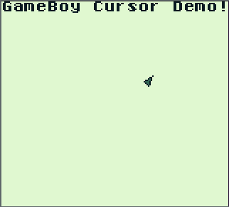
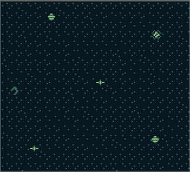
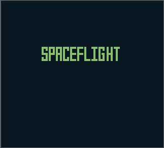
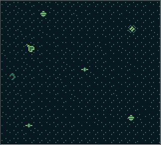

# Game Boy Programs
Various Game Boy programs created with the GBDK

The GBDK is the Game Boy development kit, which allows programs to be created for the Game Boy in C

##  Input Demo
 * Checks that all the buttons are working and displays the user input to the screen in a loop

##  Sprite Demo
 * Displays a little sprite man that has a walking animation (if you can call it that) when left dpad is pressed
 
 

##  Move Cursor Demo
 * Moves a triangular cursor around the screen
 * The sprite changes depending on the directional button pressed

 
##  Background Demo
 * A background is created based on defined tiles and is displayed on the screen
 
 

 
 
##  Space Flight
 * First "game" I managed to create for the Game Boy
 * Scrolling logo animation for the start screen
 * Same concept as Move Cursor Demo, but with background and space theme

 
